# Welcome to RedRockSoftware

### This file is intended to walk you through the features included in my app.

### First off, I used the MERN stack to build this website. For those who don't know, MERN is:

- ### MongoDB
- ### Express
- ### React
- ### Node.js

### I have build this website over the last month completely by hand (no copy and paste). I did use a few libraries on the frontend and backend, but I wanted to keep the marjority of the codebase completely handmade, after all, that is how you learn.  This website continues to be a work in progress, as I am always working on new features, as well as bug-fixes.  I am currently looking for work in web development, so the idea behind this project is to show off my skills on both the frontend and the backend. As you are reading this, if you happen to work for a company that is actively hiring, I would love to hear from you! My direct email is "ryan.codes@icloud.com".

 

# Index

### Includes a quick introduction, Github link, as well as all website updates fetched from the database.

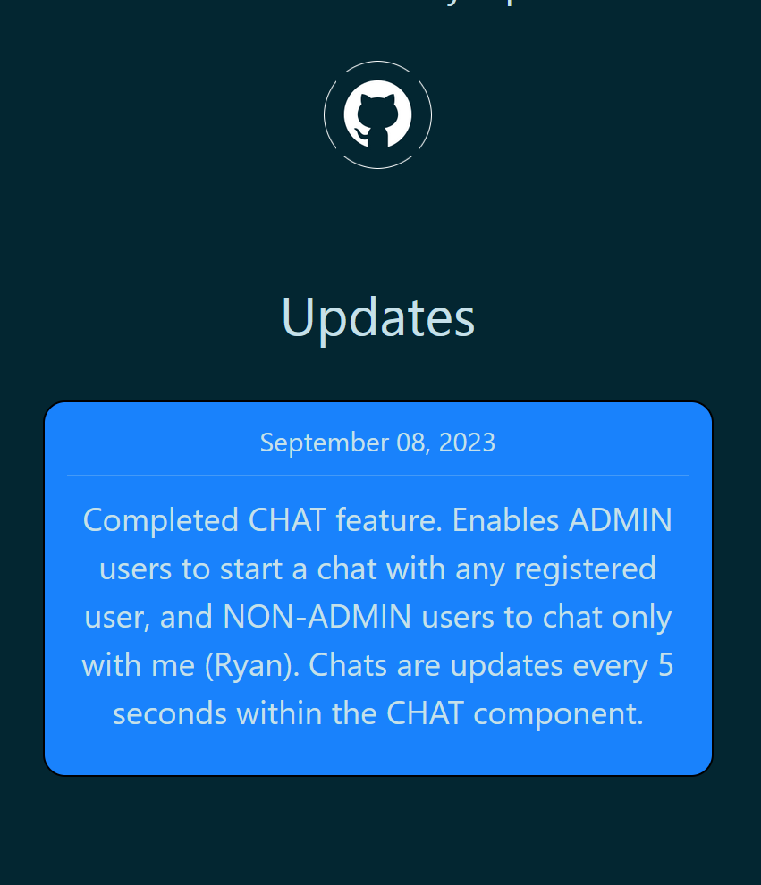

 
 
 

# Skills

### This page shows a detailed overview of my skill set. This page is growing every day!

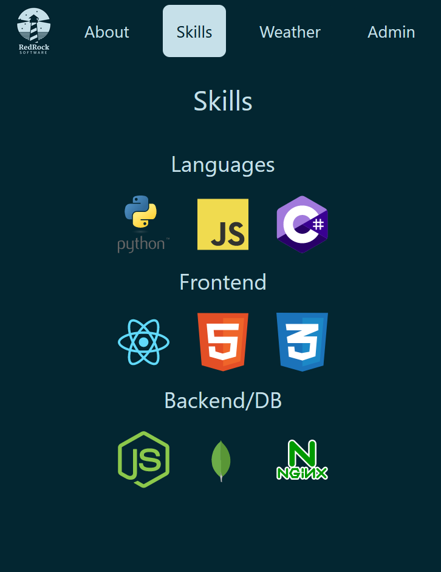

 
 
 

# Weather

### Displays current weather at two locations (Barrie and Toronto, Ontario). Weather info from OpenWeather API.

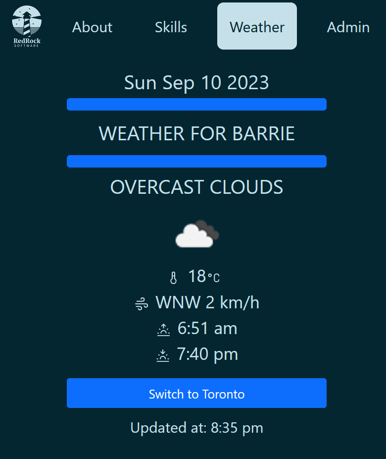

 
 
 

# Dashboard

### This is the page that ADMIN users see upon successful login. This includes the standard layout that every user will see, as well as a few ADMIN only features.

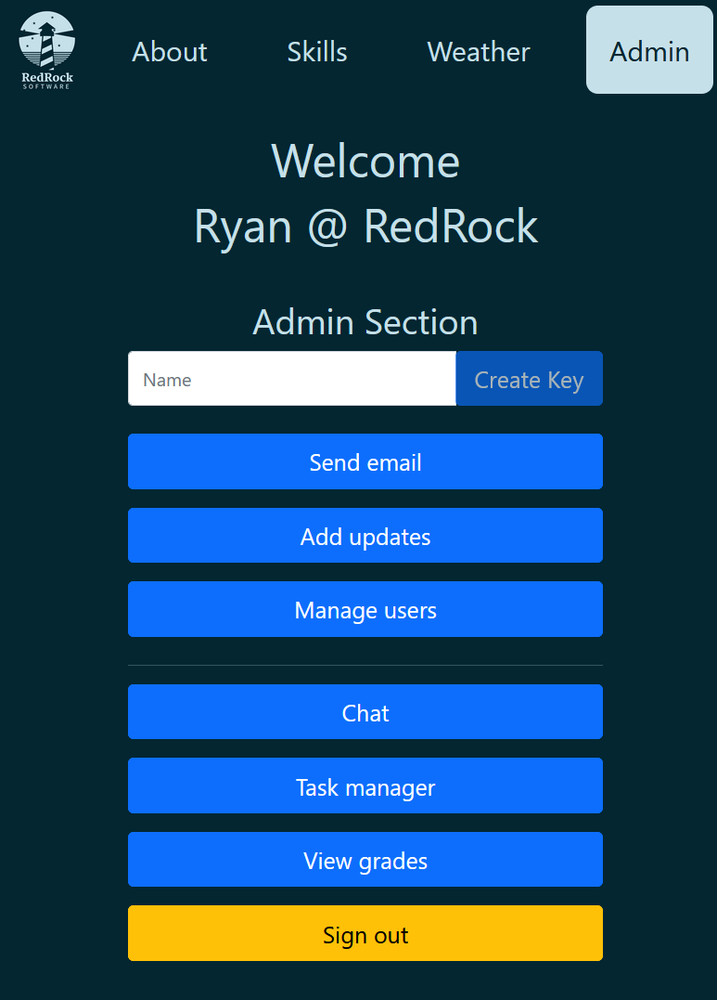

 
 
 

# Send Email

### **ADMIN ONLY** - Enables user to send an email from 'admin@redrocksoftware.ca'. Page includes email address validation before sending.

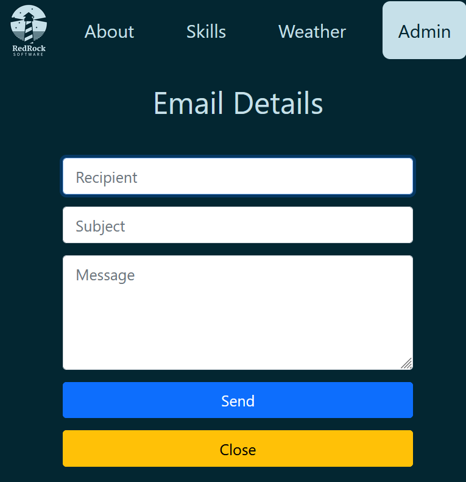

 
 
 

# Updates

### **ADMIN ONLY** - Enables user to add updates that will display on the index page. Updates are saved in the database. The date field is automatically populated based on the current date.

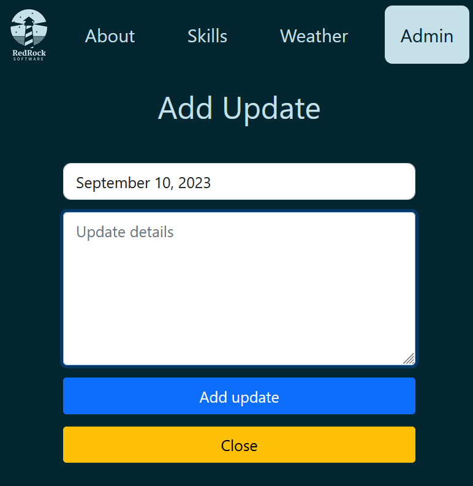

 
 
 

# Chat

### Live chat app which allows ADMIN users to chat with any user, while restricting NON-ADMIN users to only chatting with me (Ryan @ RedRockSoftware). Chats are color-coded to help distinguish between sent/received. Chats are currently being updated at 5 second intervals, allowing quick, automatic updates to the UI, while not being a burden on my server.

 

### ADMIN view

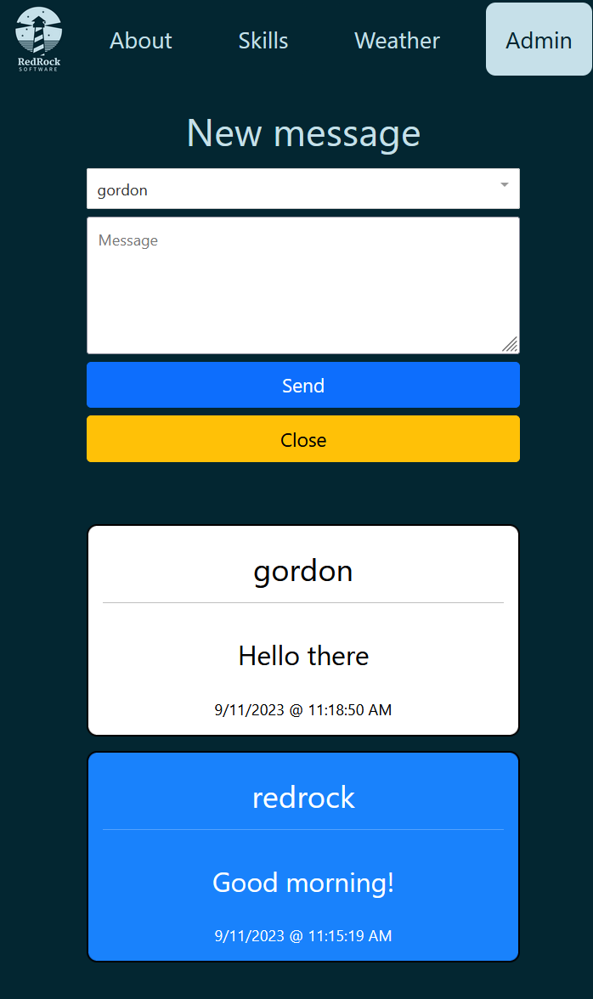

### NON-ADMIN view

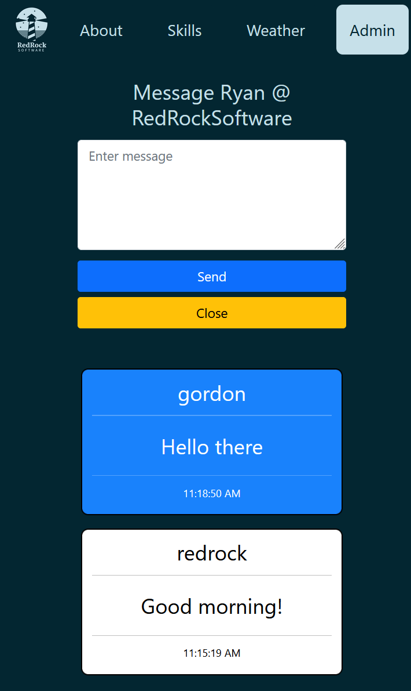

 
 
 

# Task Manager

### Task manager. Allows each user to add and delete tasks. Tasks are saved in the database.

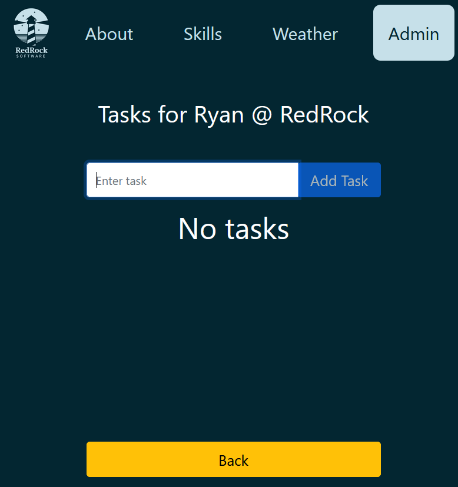

### Task manager with an active task

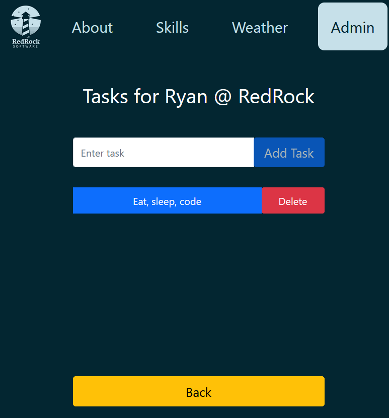

 
 
 

# Grades

### This is my favourite page on the website. It shows my grades for all courses I took in first semester.

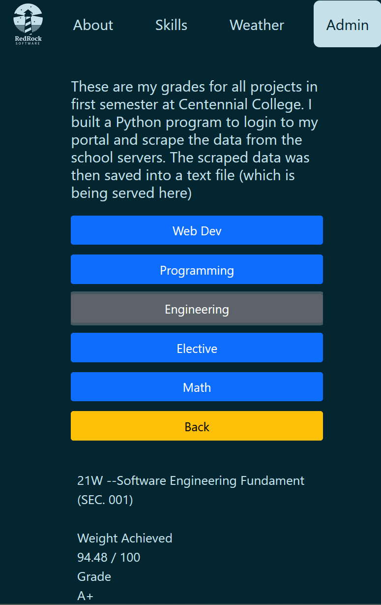
